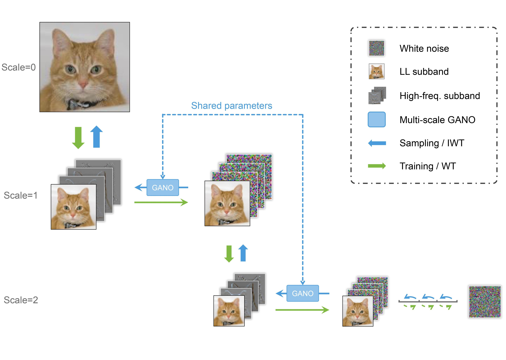

# Multi-Scale Generative Modeling In Wavelet Domain

This repository contains the official implementation code of the paper _Multi-Scale Generative Modeling In Wavelet Domain_.


## Instruction

The Multi-Scale Generative Modeling In Wavelet Domain (WMGM) model is a generative model for implementing generative models in the wavelet domain. It has showcased remarkable performance improvements and significant reduction in trainable parameters,
sampling steps and time.



## Training
### WMGM Training

1. Clone the repository to your local machine:
    ```
    git clone <the repository's URL>
    ```

2. Set up the environment
    ```
    pip install -r requirements.txt
    ```

3. Since _python_wavelet_ can not be installed directly by pip, use commands below to install.
    ```
    git clone https://github.com/fbcotter/pytorch_wavelets
    cd pytorch_wavelets
    pip install .
    ```
4. Download datasets in ./datasets folder [1]
5. To train the model, run the `train.py` script:
    ```
    python train.py --train_images_dir ./datasets/train --valid_images_dir ./datasets/valid
    ```
    
>If you need to modify the weight of loss functions or the learning rate of Generator and Discriminator , you can add exrta parameters when training
>
>The parameters are:
>- **`--lamda`**: Weight of mse loss. Default 20.
>- **`--nu`**: Weight of ssim loss. Default 0.5.
>- **`--alpha`**: Weight of dis loss. Default 0.1.
>- **`--lr_D`**: Learning rate of Generator. Default 1e-4.
>- **`--lr_G`**: Learning rate of Discriminator. Default 1e-5.

### SGM Training
For SGM, we here use the model of _improved-diffusion_[2] as out basic SGM model. Follow the steps given by them and train the model by the datasets with the pictures processed by wavelet transform.

1. Transform the data from 128\*128resolution to 32\*32resolution by wavelet transform.
```
python data_transform.py --input_dir INPUT --output_dir OUTPUT
```
2. Follow the training step of improved-diffusion with the dataset transformed[2]

## Sampling
### SGM sampling
First, we have to use SGM to sample the 32\*32 resolution low frequency wavelet-domain pictures. Please follow the instruction given by Improved Diffusion instruction.
### WMGM sampling
Second, with generated low frequency wavelet-domain pictures, we use WMGM to get high resolution pictures.

1. Use the follwing code to do sampling
   ```
   python sample_wmgm.py --data_path DATA --model_path MODEL --save_path SAVE
   ```

[1]: Datasets we used are from [CelebA-HQ128\*128](https://paperswithcode.com/dataset/celeba-hq) and  [Animal FacesHQ](https://paperswithcode.com/dataset/afhq)

[2]: Improved-Diffusion we used are from [Improved Denoising Diffusion Probabilistic Models](https://github.com/openai/improved-diffusion)
